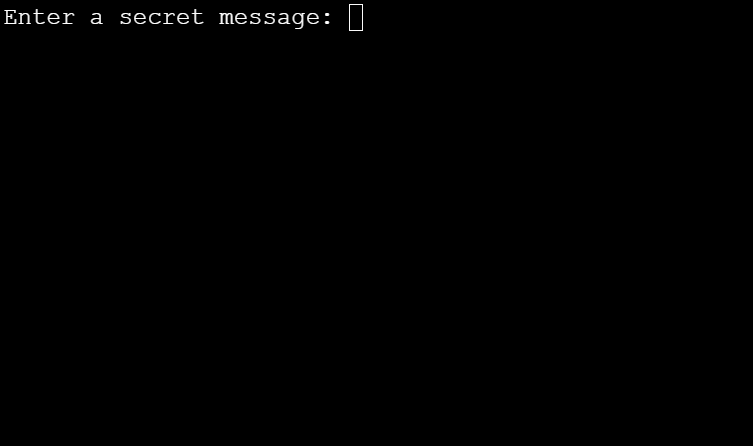

# CaesarCipher
Implementing C# arrays and loops to encrypt and decrypt messages. This app draws inspiration from the Roman Empire by creating a cipher- a tool used to encrypt texts making it unreadable to other people.

It takes every letter of your message and shifts it three places to the right. For example, A becomes D, B becomes E, C becomes F, “hello” becomes “khoor”. To decrpyt, it does the opposite and "khoor" becomes "hello".

